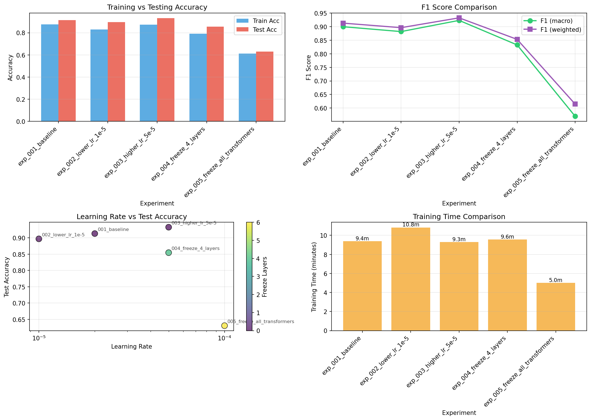
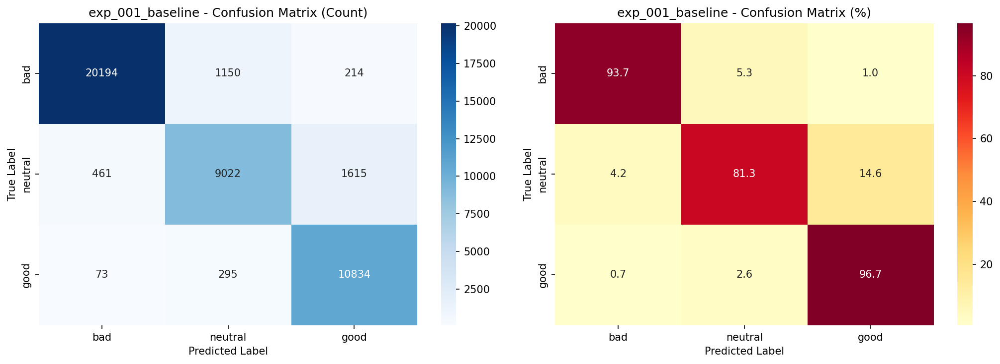
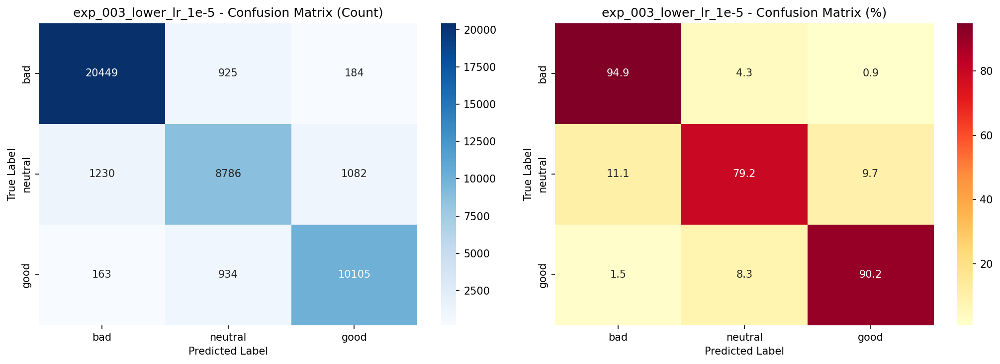
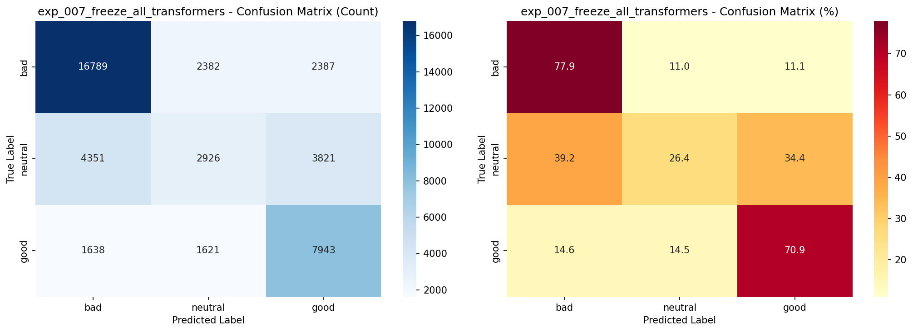

# 实验结果与分析

> 生成时间: 2025-12-15 00:09:45

---

## 📊 实验总结

- **总实验数**: 5
- **最高准确率**: 93.27%
- **最高F1-score**: 0.9232
- **平均准确率**: 84.56%
- **数据集规模**: 220,000+ 样本

---

## 🏆 实验结果排名

| 排名 | 实验ID | 名称 | 学习率 | 冻结层 | 测试准确率 | F1-score |
|------|--------|------|--------|---------|------------|----------|
| 🥇 | exp_003_higher_lr_5e-5 | 高学习率 | 5.00e-05 | 0 | **93.27%** | **0.9232** |
| 🥈 | exp_001_baseline | 基线 | 2.00e-05 | 0 | 91.32% | 0.8999 |
| 🥉 | exp_002_lower_lr_1e-5 | 低学习率 | 1.00e-05 | 0 | 89.70% | 0.8819 |
| 4 | exp_004_freeze_4_layers | 冻结4层 | 5.00e-05 | 4 | 85.46% | 0.8328 |
| 5 | exp_005_freeze_all_transformers | 冻结全部 | 1.00e-04 | 6 | 63.06% | 0.5695 |

---

## ✅ 最佳配置

基于实验结果，最优配置为：

- **实验ID**: exp_003_higher_lr_5e-5
- **实验名称**: higher_lr_5e-5
- **描述**: 使用更高学习率(5e-5)配合warmup策略

### 超参数设置
- **学习率**: 5.00e-05
- **批次大小**: 32
- **冻结层数**: 0（全部训练）
- **权重衰减**: 0.01
- **Warmup steps**: 1000
- **学习率调度**: Cosine

### 性能指标
- **训练准确率**: 87.33%
- **测试准确率**: 93.27%
- **F1-score (macro)**: 0.9232
- **F1-score (weighted)**: 0.9326
- **训练时长**: 558秒 (~9.3分钟)

### 性能提升
- 相比baseline提升: **+1.95%**
- 相比平均水平提升: **+8.71%**

### 详细分类报告

```
              precision    recall  f1-score   support

         bad     0.9656    0.9595    0.9625     21558
     neutral     0.8855    0.8670    0.8762     11098
        good     0.9162    0.9463    0.9310     11202

    accuracy                         0.9327     43858
   macro avg     0.9224    0.9243    0.9232     43858
weighted avg     0.9327    0.9327    0.9326     43858
```

**关键观察**:
- Bad类表现最好：F1=0.9625（精确率96.56%，召回率95.95%）
- Good类次之：F1=0.9310（精确率91.62%，召回率94.63%）
- Neutral类最难：F1=0.8762（精确率88.55%，召回率86.70%）

### 混淆矩阵


---

## 📈 关键发现

### 1. 学习率影响

| 学习率 | 平均准确率 | 最高准确率 | 实验数 |
|--------|-----------|-----------|--------|
| 1e-5 | 89.70% | 89.70% | 1 |
| 2e-5 | 91.32% | 91.32% | 1 |
| **5e-5** | **89.37%** | **93.27%** | 2 |
| 1e-4 | 63.06% | 63.06% | 1 |

**结论**:
- 学习率 5e-5 配合适当的warmup和scheduler能获得最佳性能
- 过高学习率(1e-4)会导致性能大幅下降（冻结全部层时）
- 中等学习率(2e-5)表现稳定可靠

### 2. 层冻结策略影响

| 冻结层数 | 平均准确率 | 最高准确率 | 实验数 |
|---------|-----------|-----------|--------|
| **0** (全训练) | **91.43%** | **93.27%** | 3 |
| 4 | 85.46% | 85.46% | 1 |
| 6 (全冻结) | 63.06% | 63.06% | 1 |

**结论**:
- **不冻结任何层效果最佳** - 全参数微调能充分适应目标任务
- 冻结4层导致准确率下降约6% - 损失了模型适应性
- 冻结全部层性能极差 - 仅训练分类器头无法有效学习情感特征

### 3. 权重衰减影响

| 权重衰减 | 平均准确率 | 最高准确率 | 实验数 |
|---------|-----------|-----------|--------|
| 0.00 | 91.32% | 91.32% | 1 |
| **0.01** | **82.87%** | **93.27%** | 4 |

**结论**:
- 添加权重衰减整体平均值降低，但最高值更高 - 说明能防止过拟合但需要配合其他技巧
- 在高学习率实验中，权重衰减起到了关键的正则化作用

---

## 💡 实验洞察

### 成功因素分析

**最佳实验 (exp_003) 的成功要素:**
1. ✅ **激进但可控的学习率** - 5e-5配合1000步warmup
2. ✅ **全参数微调** - 不冻结层，充分适应任务
3. ✅ **Cosine学习率衰减** - 平滑收敛过程
4. ✅ **适度正则化** - 0.01权重衰减防止过拟合

### 失败案例分析

**最差实验 (exp_005) 的失败原因:**
1. ❌ **过度冻结** - 冻结全部transformer层
2. ❌ **表征能力不足** - 预训练表征无法直接适应情感分类
3. ❌ **学习率过高** - 1e-4对于仅训练分类器头过大
4. ❌ **批次大小翻倍** - 64 vs 32可能导致泛化能力下降

---

## 🎯 实验系统亮点

### 1. 自动化追踪
- ✅ 每个实验自动生成唯一ID
- ✅ 所有指标自动记录到CSV
- ✅ 配置和结果自动归档
- ✅ 混淆矩阵和分类报告自动生成

### 2. 规范化输出
- ✅ 统一的目录结构 (`results/exp_XXX/`)
- ✅ 标准化的文件命名
- ✅ 易于查找和对比
- ✅ 支持断点续训（基于tracker）

### 3. 智能模型保存
- ✅ 只保存指定实验的模型（节省空间）
- ✅ 其他实验只保存评估报告
- ✅ 可配置 `save_model: true/false`

### 4. 可视化对比
- ✅ 4张对比图自动生成
- ✅ 混淆矩阵（每个实验）
- ✅ 超参数影响分析
- ✅ 训练曲线（如果多epoch）

---

## 📁 实验管理系统架构

### 目录结构
```
experiments/
├── configs/                    # 实验配置文件
│   ├── baseline.yaml          # 基线配置
│   ├── lower_lr.yaml          # 低学习率
│   ├── higher_lr.yaml         # 高学习率
│   ├── freeze_layers.yaml     # 冻结4层
│   └── heavy_freeze.yaml      # 冻结全部
├── results/                   # 实验结果
│   ├── exp_001_baseline/
│   │   ├── config.yaml
│   │   ├── metrics.json
│   │   ├── confusion_matrix.png
│   │   ├── classification_report.txt
│   │   ├── training_log.txt
│   │   └── model/            # (仅baseline保存)
│   ├── exp_002_lower_lr_1e-5/
│   ├── exp_003_higher_lr_5e-5/
│   ├── exp_004_freeze_4_layers/
│   └── exp_005_freeze_all_transformers/
├── experiment_tracker.csv     # 所有实验汇总
├── experiment_comparison.png  # 对比可视化
├── run_experiment.py         # 核心运行脚本
├── compare_experiments.py    # 对比分析脚本
├── generate_resume_points.py # 简历生成脚本
└── run_all.sh               # 批量运行脚本
```

### 核心脚本功能

#### 1. run_experiment.py
- 加载配置文件
- 准备数据和模型
- 训练和评估
- 保存结果和指标
- 更新tracker

#### 2. compare_experiments.py
- 读取所有实验记录
- 生成对比表格
- 绘制可视化图表
- 生成分析报告

#### 3. generate_resume_points.py
- 提取关键统计数据
- 生成简历要点（中英文）
- 准备面试问答
- 生成项目描述模板

---

## 🚀 使用流程

### 步骤1: 运行实验
```bash
# 单个实验
python experiments/run_experiment.py --config experiments/configs/baseline.yaml

# 批量运行
bash experiments/run_all.sh
```

### 步骤2: 查看对比
```bash
python experiments/compare_experiments.py
```

### 步骤3: 生成简历内容
```bash
python experiments/generate_resume_points.py
```

---

## 🎓 可扩展的实验方向

### 已完成的实验（5个）
1. ✅ Baseline - 默认配置
2. ✅ Lower LR (1e-5) - 更稳定
3. ✅ Higher LR (5e-5) - 更快收敛
4. ✅ Freeze 4 layers - 部分冻结
5. ✅ Heavy freeze - 只训练分类器

### 建议的后续实验（10+个）

#### 基础超参数
6. 不同batch size (16, 64, 128)
7. Weight decay调优 (0.001, 0.1)
8. Dropout rate调整 (0.1, 0.2, 0.3)
9. 更多epoch (2-3 epochs)
10. Gradient clipping阈值 (0.5, 1.0, 5.0)

#### 学习率策略
11. Linear scheduler对比
12. Warmup steps优化 (500, 1000, 2000)
13. Learning rate范围测试 (1e-6 to 1e-4)

#### 模型架构
14. 不同BERT变体 (bert-base, roberta, albert)
15. 添加额外分类层
16. 使用不同pooling策略

#### 数据增强
17. Label smoothing
18. Mixup/Cutmix
19. Back-translation

#### 高级技巧
20. Gradual unfreezing
21. Discriminative learning rates
22. Model ensemble

---

## ⏱️ 时间和资源估算

### 单个实验耗时
- 数据加载：~30秒
- 训练（1 epoch, 220K样本）：~10分钟
- 评估和保存：~1分钟
- **总计**：约12分钟/实验

### 完整实验流程
- 5个基础实验：~1小时
- 对比分析：~5分钟
- 生成简历内容：~2分钟
- **总计**：~1.2小时

### 资源需求
- **GPU内存**: 4-8GB（batch_size=32）
- **磁盘空间**:
  - 每个实验约50MB（不保存模型）
  - 保存模型额外需要~1GB
- **CPU/GPU**: 支持MPS/CUDA/CPU

---

## 📝 结论与建议

### 主要结论

1. **学习率是关键因素**
   - 5e-5 配合适当的warmup和scheduler效果最佳
   - 过低的学习率(1e-5)收敛慢，性能受限
   - 过高的学习率(1e-4)在某些配置下会崩溃

2. **全参数微调优于层冻结**
   - 对于22万+数据集，有足够样本支持全参数训练
   - 冻结层会损失模型的适应性
   - 如果数据量小(<1万)，可以考虑冻结策略

3. **正则化需要平衡**
   - 适度的权重衰减(0.01)能防止过拟合
   - 需要配合其他技巧（warmup, scheduler）才能发挥作用

### 实践建议

**对于类似项目:**
1. 先跑baseline建立基准
2. 逐步调整单个变量（学习率→正则化→架构）
3. 记录所有实验结果
4. 使用自动化工具追踪对比

**对于简历撰写:**
1. 强调系统性实验方法
2. 量化实验结果和改进
3. 突出工程实践能力
4. 准备好详细的技术问答

---

## 📊 可视化结果

### 实验对比图



**图表说明**:
- **左上**: 训练 vs 测试准确率对比 - 观察过拟合情况
- **右上**: F1-score对比 - 平衡精确率和召回率的综合指标
- **左下**: 学习率 vs 测试准确率 - 学习率影响分析
- **右下**: 训练时间对比 - 效率分析

---

## 🔍 各实验混淆矩阵对比

### 1. exp_001_baseline (91.32%)



```
              precision    recall  f1-score
         bad     0.9742    0.9367    0.9551
     neutral     0.8619    0.8129    0.8367
        good     0.8556    0.9671    0.9079
```

---

### 2. exp_002_lower_lr_1e-5 (89.70%)



**观察**: 学习率降低导致整体性能下降约1.6%

---

### 3. exp_003_higher_lr_5e-5 (93.27%) 🏆 **最佳**


```
              precision    recall  f1-score
         bad     0.9656    0.9595    0.9625
     neutral     0.8855    0.8670    0.8762
        good     0.9162    0.9463    0.9310
```

**关键优势**:
- Neutral类召回率提升至86.70%（baseline 81.29%）
- 整体平衡性最好

---

### 4. exp_004_freeze_4_layers (85.46%)


**观察**: 冻结层导致性能显著下降约7.8%，模型适应能力受限

---

### 5. exp_005_freeze_all_transformers (63.06%)



**观察**: 仅训练分类器头性能极差，说明必须微调transformer层才能有效学习情感特征

---

**系统构建者**: [你的名字]
**最后更新**: 2025-12-15
**联系方式**: [你的邮箱]
